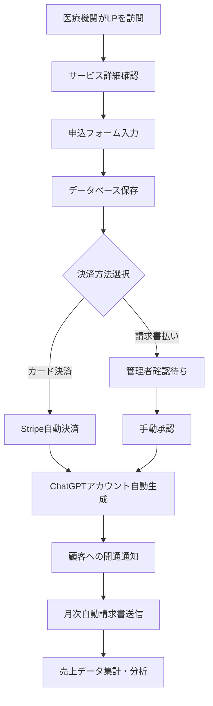

# ChatGPT Plus LP - 包括的開発ロードマップ 2025

**作成日時**: 2025年6月5日  
**目的**: 現在の実装を基に、完全な医療機関向けChatGPT Plusサービスシステムの実現

---

## 📊 現在の実装状況（2025年6月5日時点）

### ✅ 完成済み機能

#### 1. 管理画面システム（Admin Dashboard）
- **技術**: React + TypeScript + Material-UI
- **機能**: 
  - ダッシュボード（売上推移グラフ、月次データ可視化）
  - 顧客管理（医療機関種別、住所、申込情報）
  - 請求書管理（PDF生成・プレビュー・メール送信）
  - 会社設定（SendGrid連携、テンプレート管理）
- **データ**: 現在はローカルストレージ（開発用）

#### 2. Azure Functions API
- **PDF生成API**: PDFKit使用の請求書生成
- **メール送信API**: SendGrid連携の自動送信
- **データ管理API**: 顧客・ダッシュボード情報
- **開発環境**: ローカルで稼働確認済み

#### 3. SendGrid連携
- **テンプレートシステム**: 20+変数対応
- **条件分岐**: 住所の有無による表示制御
- **開発環境テスト**: 実際のメール送信確認済み

### 🔄 既存の部分実装
- **ランディングページ**: 基本的なHTML/CSS/JS（docs/）
- **Azure Table Storage**: 一部の申込データ保存
- **Power BI連携**: DAXクエリ・レポート作成済み

---

## 🎯 最終ゴール：完全自動化された医療機関向けSaaSプラットフォーム

### ビジネスフロー全体像


---

## 🏗️ 技術アーキテクチャ設計

### Azureサービス構成
```
┌─────────────────┐  ┌──────────────────┐  ┌─────────────────┐
│   Frontend      │  │     Backend      │  │   Database      │
├─────────────────┤  ├──────────────────┤  ├─────────────────┤
│ Azure Static    │  │ Azure Functions  │  │ Azure SQL       │
│ Web Apps        │  │ - Node.js/TS     │  │ - 顧客DB        │
│ - React SPA     │  │ - API Gateway    │  │ - 取引DB        │
│ - 管理画面      │  │ - PDF生成        │  │ - 設定DB        │
│ - 顧客申込画面  │  │ - メール送信     │  │                 │
└─────────────────┘  └──────────────────┘  └─────────────────┘
         │                     │                     │
         └─────────────────────┼─────────────────────┘
                               │
                ┌──────────────────────┐
                │   External Services  │
                ├──────────────────────┤
                │ - SendGrid (メール)  │
                │ - Stripe (決済)      │
                │ - Power BI (分析)    │
                │ - ChatGPT API        │
                └──────────────────────┘
```

---

## 📋 段階的実装計画

### Phase 1: データベース基盤構築（1-2週間）

#### 1.1 Azure SQL Database セットアップ
```sql
-- 顧客データベース（customers_db）
CREATE TABLE Customers (
    customer_id UNIQUEIDENTIFIER PRIMARY KEY DEFAULT NEWID(),
    organization_name NVARCHAR(200) NOT NULL,
    contact_person NVARCHAR(100) NOT NULL,
    email NVARCHAR(100) NOT NULL UNIQUE,
    phone_number NVARCHAR(20),
    postal_code NVARCHAR(10),
    address NVARCHAR(500),
    facility_type NVARCHAR(50), -- hospital, clinic, dental_clinic, etc
    requested_account_count INT,
    application_date DATETIME2,
    status NVARCHAR(20) DEFAULT 'pending', -- pending, active, suspended, cancelled
    payment_method NVARCHAR(20), -- card, invoice
    stripe_customer_id NVARCHAR(100),
    created_at DATETIME2 DEFAULT GETDATE(),
    updated_at DATETIME2 DEFAULT GETDATE()
);

-- ChatGPTアカウント管理
CREATE TABLE ChatGPTAccounts (
    account_id UNIQUEIDENTIFIER PRIMARY KEY DEFAULT NEWID(),
    customer_id UNIQUEIDENTIFIER FOREIGN KEY REFERENCES Customers(customer_id),
    email NVARCHAR(100) NOT NULL,
    is_active BIT DEFAULT 1,
    product_id UNIQUEIDENTIFIER,
    start_date DATETIME2,
    end_date DATETIME2,
    subscription_months INT DEFAULT 12,
    created_at DATETIME2 DEFAULT GETDATE()
);

-- 売上管理データベース（sales_db）
CREATE TABLE Invoices (
    invoice_id UNIQUEIDENTIFIER PRIMARY KEY DEFAULT NEWID(),
    customer_id UNIQUEIDENTIFIER FOREIGN KEY REFERENCES Customers(customer_id),
    invoice_number NVARCHAR(50) NOT NULL UNIQUE,
    billing_type NVARCHAR(20), -- monthly, yearly
    total_amount DECIMAL(10,2),
    tax_amount DECIMAL(10,2),
    issue_date DATETIME2,
    due_date DATETIME2,
    status NVARCHAR(20) DEFAULT 'draft', -- draft, sent, paid, overdue
    pdf_url NVARCHAR(500),
    email_sent_at DATETIME2,
    created_at DATETIME2 DEFAULT GETDATE()
);

-- 製品・プラン管理
CREATE TABLE Products (
    product_id UNIQUEIDENTIFIER PRIMARY KEY DEFAULT NEWID(),
    product_name NVARCHAR(200) NOT NULL,
    unit_price DECIMAL(10,2) NOT NULL,
    tax_rate DECIMAL(5,2) DEFAULT 0.10,
    is_active BIT DEFAULT 1,
    created_at DATETIME2 DEFAULT GETDATE()
);
```

#### 1.2 Azure Functions データベース接続
- `mssql` パッケージを使用
- 接続プール設定
- エラーハンドリング
- トランザクション管理

### Phase 2: 顧客申込システム構築（2-3週間）

#### 2.1 顧客申込フォーム（React SPA）
```typescript
// 申込フォームコンポーネント
interface ApplicationForm {
  organizationName: string;
  contactPerson: string;
  email: string;
  phoneNumber: string;
  postalCode: string;
  address: string;
  facilityType: 'hospital' | 'clinic' | 'dental_clinic' | 'pharmacy' | 'nursing_home' | 'other';
  requestedAccountCount: number;
  paymentMethod: 'card' | 'invoice';
  agreementAccepted: boolean;
}
```

**機能要件**:
- 医療機関情報入力
- バリデーション（メールアドレス、必須項目）
- プライバシーポリシー同意
- 見積もり自動計算
- 申込確認画面

#### 2.2 申込処理API
```javascript
// Azure Functions: /api/customer-application
module.exports = async function (context, req) {
    const applicationData = req.body;
    
    // 1. データ検証
    const validation = validateApplicationData(applicationData);
    
    // 2. データベース保存
    const customerId = await saveCustomerApplication(applicationData);
    
    // 3. 管理者通知メール送信
    await sendAdminNotification(customerId, applicationData);
    
    // 4. 顧客確認メール送信
    await sendCustomerConfirmation(applicationData.email);
    
    return { customerId, status: 'received' };
};
```

### Phase 3: 決済システム統合（2-3週間）

#### 3.1 Stripe決済統合
```javascript
// Stripe Checkout Session作成
const session = await stripe.checkout.sessions.create({
    payment_method_types: ['card'],
    line_items: [{
        price_data: {
            currency: 'jpy',
            product_data: {
                name: 'ChatGPT Plus 医療機関向けプラン',
                description: `${accountCount}アカウント × ${months}ヶ月`
            },
            unit_amount: totalAmount * 100 // 円→銭変換
        },
        quantity: 1
    }],
    mode: 'payment',
    success_url: `${baseUrl}/payment/success?session_id={CHECKOUT_SESSION_ID}`,
    cancel_url: `${baseUrl}/payment/cancel`,
    customer_email: customerEmail,
    metadata: {
        customer_id: customerId,
        billing_type: billingType
    }
});
```

#### 3.2 Webhook処理
```javascript
// /api/stripe-webhook
module.exports = async function (context, req) {
    const sig = req.headers['stripe-signature'];
    const event = stripe.webhooks.constructEvent(req.body, sig, endpointSecret);
    
    switch (event.type) {
        case 'checkout.session.completed':
            await handlePaymentSuccess(event.data.object);
            break;
        case 'payment_intent.payment_failed':
            await handlePaymentFailure(event.data.object);
            break;
    }
};
```

### Phase 4: 自動化ワークフロー（2-3週間）

#### 4.1 ChatGPTアカウント自動プロビジョニング
```javascript
// アカウント作成自動化
async function provisionChatGPTAccounts(customerId, accountCount) {
    const customer = await getCustomerById(customerId);
    const accounts = [];
    
    for (let i = 0; i < accountCount; i++) {
        const email = generateAccountEmail(customer.organization, i + 1);
        
        // ChatGPT Team アカウント作成API呼び出し
        const account = await createChatGPTAccount({
            email: email,
            organizationName: customer.organization,
            planType: 'team'
        });
        
        accounts.push(account);
        
        // データベースに保存
        await saveChatGPTAccount({
            customerId: customerId,
            email: email,
            externalAccountId: account.id,
            startDate: new Date(),
            endDate: addMonths(new Date(), 12)
        });
    }
    
    // 顧客に開通通知
    await sendAccountActivationEmail(customer.email, accounts);
    
    return accounts;
}
```

#### 4.2 月次自動請求書生成
```javascript
// Azure Functions Timer Trigger（月次実行）
module.exports = async function (context, myTimer) {
    const activeCustomers = await getActiveCustomers();
    
    for (const customer of activeCustomers) {
        const activeAccounts = await getActiveAccountsByCustomer(customer.id);
        const invoiceData = calculateMonthlyInvoice(customer, activeAccounts);
        
        // PDF生成
        const pdfUrl = await generateInvoicePDF(invoiceData);
        
        // データベース保存
        const invoiceId = await saveInvoice({
            ...invoiceData,
            pdfUrl: pdfUrl,
            status: 'sent'
        });
        
        // メール送信
        await sendInvoiceEmail(customer.email, pdfUrl, invoiceData);
    }
};
```

### Phase 5: 管理画面の完全統合（1-2週間）

#### 5.1 既存管理画面のDB接続
- ローカルストレージ → Azure SQL Database移行
- リアルタイムデータ表示
- 管理者権限管理（Azure AD B2C）

#### 5.2 新機能追加
- 申込承認ワークフロー
- 顧客ステータス管理
- アカウント使用状況監視
- 売上レポート詳細化

---

## 🛠️ 必要な技術要素

### 新規追加が必要な技術
1. **Azure SQL Database**: 顧客・売上データ永続化
2. **Stripe SDK**: 決済処理
3. **Azure AD B2C**: 管理者認証
4. **Azure Key Vault**: 秘密情報管理
5. **Application Insights**: 監視・ログ
6. **Azure Logic Apps**: ワークフロー自動化（オプション）

### 既存技術の拡張
1. **Azure Functions**: API拡張
2. **SendGrid**: メールテンプレート追加
3. **React管理画面**: DB接続対応
4. **PDFKit**: 請求書テンプレート改良

---

## 💰 コスト見積もり（月額）

### Azure サービス
- **Azure SQL Database** (Basic): ¥500-1,000
- **Azure Functions** (Consumption): ¥100-500
- **Azure Static Web Apps** (Standard): ¥1,000
- **Application Insights**: ¥100-300
- **Azure Key Vault**: ¥100

### 外部サービス
- **SendGrid** (Essential): $19.95 (約¥3,000)
- **Stripe**: 3.6% (決済手数料)

**合計**: 月額約¥5,000-7,000（決済手数料除く）

---

## 📅 実装タイムライン

### 2025年6月（Phase 1-2）
- **Week 1**: Azure SQL Database構築
- **Week 2**: データベース接続API開発
- **Week 3**: 顧客申込フォーム開発
- **Week 4**: 申込処理API・メール通知

### 2025年7月（Phase 3-4）
- **Week 1-2**: Stripe決済統合
- **Week 3-4**: 自動化ワークフロー構築

### 2025年8月（Phase 5）
- **Week 1-2**: 管理画面DB統合
- **Week 3**: テスト・デバッグ
- **Week 4**: 本番リリース

---

## 🎯 成功指標（KPI）

### 技術指標
- **可用性**: 99.9%以上
- **レスポンス時間**: 2秒以内
- **エラー率**: 1%未満

### ビジネス指標
- **申込→開通時間**: 24時間以内（カード決済）
- **自動化率**: 90%以上
- **顧客満足度**: 95%以上

---

## 🔒 セキュリティ・コンプライアンス

### データ保護
- **暗号化**: 保存時・転送時ともに実装
- **アクセス制御**: RBAC + MFA必須
- **監査ログ**: 全操作の記録
- **データ保持**: GDPR準拠

### 医療機関対応
- **プライバシー保護**: 個人情報取り扱い厳格化
- **セキュリティ証明**: ISO27001準拠検討
- **データ所在地**: 日本国内限定

---

## 📈 将来の拡張計画

### 機能拡張
1. **マルチテナント対応**: 複数の販売代理店
2. **API公開**: パートナー企業との連携
3. **モバイルアプリ**: 顧客向けダッシュボード
4. **AI活用**: 使用パターン分析・最適化

### スケーリング
1. **Azure Cosmos DB**: グローバル展開対応
2. **CDN**: 世界規模でのパフォーマンス最適化
3. **Container Apps**: マイクロサービス化

---

## 🚀 次のアクション（今後1週間）

### 即座に着手
1. **Azure SQL Database作成**
2. **データベーススキーマ設計**
3. **Stripeアカウント開設**

### 設計・準備作業
1. **詳細なAPI仕様書作成**
2. **UIワイヤーフレーム作成**
3. **セキュリティ要件定義**

### 環境整備
1. **開発環境のAzure環境構築**
2. **CI/CDパイプライン設計**
3. **テスト計画策定**

---

**この包括的ロードマップにより、現在の管理画面システムを基盤として、完全に自動化された医療機関向けChatGPT Plusサービスプラットフォームを3ヶ月で実現可能です。**

**作成者**: Claude Code  
**承認待ち**: プロジェクトオーナー