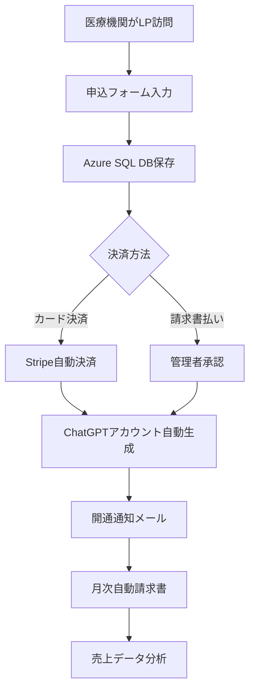

# 📋 ChatGPT Plus LP - プロジェクトTODO & ロードマップ

**作成日**: 2025年6月5日  
**更新日**: 2025年6月5日  
**プロジェクト**: 医療機関向けChatGPT Plus自動化SaaSプラットフォーム

---

## 🎯 最終ゴール（3ヶ月後の完成形）

### 完全自動化されたビジネスフロー


### システム全体像
```
┌─────────────────┐  ┌──────────────────┐  ┌─────────────────┐
│   フロントエンド │  │   バックエンド   │  │   データベース  │
├─────────────────┤  ├──────────────────┤  ├─────────────────┤
│ Azure Static    │  │ Azure Functions  │  │ Azure SQL       │
│ Web Apps        │  │ ✅ PDF生成API    │  │ ❌ 顧客DB       │
│ ✅ 管理画面     │  │ ✅ メール送信API │  │ ❌ 売上DB       │
│ ❌ 申込フォーム │  │ ❌ 申込処理API   │  │ ❌ 契約DB       │
│ ❌ 決済ページ   │  │ ❌ 決済処理API   │  │                 │
└─────────────────┘  └──────────────────┘  └─────────────────┘
         │                     │                     │
         └─────────────────────┼─────────────────────┘
                               │
                ┌──────────────────────┐
                │   外部サービス連携   │
                ├──────────────────────┤
                │ ✅ SendGrid (メール) │
                │ ❌ Stripe (決済)     │
                │ ❌ ChatGPT API       │
                │ ✅ Power BI (分析)   │
                └──────────────────────┘
```

**✅ = 実装済み, ❌ = 未実装**

---

## 📅 段階別実装計画

### 🟦 Phase 1: データベース基盤構築（Week 1-2）

#### TODO 1.1: Azure SQL Database セットアップ
- [ ] **Azure ポータルでSQL Database作成**
  - データベース名: `chatgpt_plus_main_db`
  - 価格帯: Basic (¥500-1,000/月)
  - 地域: Japan East

- [ ] **データベーススキーマ設計・実装**
  ```sql
  -- 顧客マスタ
  CREATE TABLE Customers (
      customer_id UNIQUEIDENTIFIER PRIMARY KEY,
      organization_name NVARCHAR(200) NOT NULL,
      contact_person NVARCHAR(100) NOT NULL,
      email NVARCHAR(100) UNIQUE NOT NULL,
      phone_number NVARCHAR(20),
      postal_code NVARCHAR(10),
      address NVARCHAR(500),
      facility_type NVARCHAR(50),
      requested_account_count INT,
      application_date DATETIME2,
      status NVARCHAR(20) DEFAULT 'pending',
      payment_method NVARCHAR(20),
      stripe_customer_id NVARCHAR(100),
      created_at DATETIME2 DEFAULT GETDATE(),
      updated_at DATETIME2 DEFAULT GETDATE()
  );

  -- ChatGPTアカウント管理
  CREATE TABLE ChatGPTAccounts (
      account_id UNIQUEIDENTIFIER PRIMARY KEY,
      customer_id UNIQUEIDENTIFIER FOREIGN KEY,
      email NVARCHAR(100) NOT NULL,
      is_active BIT DEFAULT 1,
      product_id UNIQUEIDENTIFIER,
      start_date DATETIME2,
      end_date DATETIME2,
      subscription_months INT DEFAULT 12,
      created_at DATETIME2 DEFAULT GETDATE()
  );

  -- 請求書管理
  CREATE TABLE Invoices (
      invoice_id UNIQUEIDENTIFIER PRIMARY KEY,
      customer_id UNIQUEIDENTIFIER FOREIGN KEY,
      invoice_number NVARCHAR(50) UNIQUE NOT NULL,
      billing_type NVARCHAR(20),
      total_amount DECIMAL(10,2),
      tax_amount DECIMAL(10,2),
      issue_date DATETIME2,
      due_date DATETIME2,
      status NVARCHAR(20) DEFAULT 'draft',
      pdf_url NVARCHAR(500),
      email_sent_at DATETIME2,
      created_at DATETIME2 DEFAULT GETDATE()
  );

  -- 製品マスタ
  CREATE TABLE Products (
      product_id UNIQUEIDENTIFIER PRIMARY KEY,
      product_name NVARCHAR(200) NOT NULL,
      unit_price DECIMAL(10,2) NOT NULL,
      tax_rate DECIMAL(5,2) DEFAULT 0.10,
      is_active BIT DEFAULT 1,
      created_at DATETIME2 DEFAULT GETDATE()
  );
  ```

#### TODO 1.2: Azure Functions データベース接続
- [ ] **mssqlパッケージインストール**
  ```bash
  cd api
  npm install mssql
  ```

- [ ] **データベース接続モジュール作成**
  - ファイル: `api/shared/database.js`
  - 接続プール設定
  - エラーハンドリング
  - 環境変数管理

- [ ] **既存管理画面のDB統合**
  - 現在: ローカルストレージ → 変更後: Azure SQL
  - 顧客データ取得API更新
  - 売上データ計算ロジック更新

### 🟩 Phase 2: 顧客申込システム（Week 3-4）

#### TODO 2.1: 顧客申込フォーム開発
- [ ] **新しいReactコンポーネント作成**
  ```
  customer-application/
  ├── src/
  │   ├── components/
  │   │   ├── ApplicationForm.tsx
  │   │   ├── EstimateCalculator.tsx
  │   │   ├── PaymentMethodSelector.tsx
  │   │   └── ConfirmationScreen.tsx
  │   ├── services/
  │   │   └── applicationApi.ts
  │   └── types/
  │       └── application.ts
  ```

- [ ] **申込フォーム要素**
  - 医療機関情報入力
  - 見積もり自動計算
  - 決済方法選択
  - 利用規約同意
  - 確認画面

- [ ] **バリデーション実装**
  - メールアドレス形式
  - 必須項目チェック
  - 電話番号形式
  - 郵便番号形式

#### TODO 2.2: 申込処理API開発
- [ ] **Azure Functions API作成**
  ```
  api/
  ├── customer-application/
  │   ├── function.json
  │   └── index.js
  ├── customer-validation/
  │   ├── function.json
  │   └── index.js
  └── notification-email/
      ├── function.json
      └── index.js
  ```

- [ ] **申込処理フロー**
  1. データ検証
  2. 重複チェック
  3. データベース保存
  4. 管理者通知メール
  5. 顧客確認メール
  6. ダッシュボード更新

### 🟨 Phase 3: 決済システム統合（Week 5-6）

#### TODO 3.1: Stripe連携基盤
- [ ] **Stripeアカウント開設**
  - 本番アカウント作成
  - テスト環境設定
  - Webhook URL設定

- [ ] **Stripe SDK統合**
  ```bash
  npm install stripe
  ```

- [ ] **決済フロー設計**
  ```javascript
  // Checkout Session作成
  const session = await stripe.checkout.sessions.create({
      payment_method_types: ['card'],
      line_items: [{
          price_data: {
              currency: 'jpy',
              product_data: {
                  name: 'ChatGPT Plus 医療機関向けプラン',
              },
              unit_amount: totalAmount * 100
          },
          quantity: 1
      }],
      mode: 'payment',
      success_url: 'https://yourapp.com/payment/success',
      cancel_url: 'https://yourapp.com/payment/cancel'
  });
  ```

#### TODO 3.2: Webhook処理実装
- [ ] **決済完了処理**
  - 顧客ステータス更新
  - ChatGPTアカウント生成トリガー
  - 開通通知メール

- [ ] **決済失敗処理**
  - エラーログ記録
  - 管理者通知
  - 顧客への再試行案内

### 🟪 Phase 4: 自動化ワークフロー（Week 7-8）

#### TODO 4.1: ChatGPTアカウント自動生成
- [ ] **ChatGPT Team API調査・連携**
  - API仕様確認
  - 認証方法調査
  - アカウント作成自動化

- [ ] **プロビジョニング処理**
  ```javascript
  async function provisionAccounts(customerId, accountCount) {
      // 1. 顧客情報取得
      // 2. アカウントメール生成
      // 3. ChatGPT API呼び出し
      // 4. データベース更新
      // 5. 開通通知送信
  }
  ```

#### TODO 4.2: 月次自動請求書システム
- [ ] **Timer Trigger Function作成**
  ```
  api/monthly-billing/
  ├── function.json (Timer Trigger設定)
  └── index.js
  ```

- [ ] **自動請求処理**
  1. アクティブ顧客取得
  2. 月次料金計算
  3. PDF請求書生成
  4. メール送信
  5. ステータス更新

### 🟫 Phase 5: 管理画面完全統合（Week 9-10）

#### TODO 5.1: 管理画面DB統合
- [ ] **既存コンポーネント更新**
  - `CustomerDetail.tsx`: SQL DB接続
  - `Dashboard.tsx`: リアルタイムデータ
  - `RevenueChart.tsx`: 実データベース連携

- [ ] **新機能追加**
  - 申込承認画面
  - アカウント使用状況監視
  - 決済ステータス管理

#### TODO 5.2: 認証・権限管理
- [ ] **Azure AD B2C統合**
  - 管理者ログイン
  - ロールベースアクセス制御
  - セッション管理

### 🟥 Phase 6: 本番デプロイ・運用（Week 11-12）

#### TODO 6.1: 本番環境構築
- [ ] **Azure Static Web Apps本番デプロイ**
- [ ] **カスタムドメイン設定**
- [ ] **SSL証明書設定**
- [ ] **CDN設定**

#### TODO 6.2: 監視・運用体制
- [ ] **Application Insights設定**
- [ ] **エラー通知設定**
- [ ] **パフォーマンス監視**
- [ ] **運用マニュアル作成**

---

## 🔧 技術的準備作業（今すぐ着手）

### 即座に実施すべきTODO
- [ ] **Azureアカウント課金確認・予算設定**
- [ ] **Azure SQL Database作成開始**
- [ ] **Stripeアカウント申請開始**
- [ ] **ChatGPT Team API アクセス調査**

### 設計ドキュメント作成
- [ ] **詳細なAPI仕様書作成**
- [ ] **データベース設計書完成**
- [ ] **セキュリティ要件定義**
- [ ] **テスト計画書作成**

### 開発環境整備
- [ ] **CI/CDパイプライン設計**
- [ ] **開発・ステージング・本番環境分離**
- [ ] **コードレビュー体制構築**

---

## 💰 コスト管理・予算

### 月額運用コスト見積もり
- **Azure SQL Database (Basic)**: ¥500-1,000
- **Azure Functions (Consumption)**: ¥100-500
- **Azure Static Web Apps (Standard)**: ¥1,000
- **Application Insights**: ¥100-300
- **SendGrid (Essential)**: ¥3,000
- **Stripe手数料**: 売上の3.6%

**合計**: 月額約¥5,000-7,000 + 決済手数料

### 開発期間中のコスト
- **3ヶ月開発期間**: 約¥20,000-25,000
- **追加ツール・サービス**: 約¥10,000

---

## 📊 成功指標（KPI）

### 技術指標
- [ ] **システム可用性**: 99.9%以上
- [ ] **API応答時間**: 2秒以内
- [ ] **エラー率**: 1%未満
- [ ] **セキュリティ監査**: 脆弱性ゼロ

### ビジネス指標
- [ ] **申込→開通時間**: 24時間以内（カード決済）
- [ ] **自動化率**: 90%以上の処理が無人化
- [ ] **顧客満足度**: 95%以上
- [ ] **月次請求書送信自動化**: 100%

---

## 🚨 リスク管理

### 技術リスク
- [ ] **ChatGPT API制限**: 代替手段検討
- [ ] **Stripe審査**: 事前申請・対応
- [ ] **Azure可用性**: マルチリージョン検討

### ビジネスリスク
- [ ] **競合サービス**: 差別化要素強化
- [ ] **規制変更**: 医療機関向け要件監視
- [ ] **スケール問題**: 性能テスト実施

---

## 📞 次のアクション（今後1週間）

### 今日中に着手
1. **Azure SQL Database作成開始**
2. **Stripeアカウント申請**
3. **プロジェクト詳細スケジュール作成**

### 今週中に完了
1. **データベーススキーマ実装**
2. **既存管理画面のDB接続改修**
3. **申込フォーム基本設計**

### 来週開始予定
1. **申込フォーム開発開始**
2. **Stripe統合準備**
3. **ChatGPT API調査完了**

---

## 🎯 3ヶ月後のビジョン

**「医療機関が申し込みボタンを押してから24時間以内に、ChatGPTアカウントが自動で開通され、月次で自動請求書が送信される、完全自動化されたSaaSプラットフォーム」**

### 実現される価値
- **医療機関**: 簡単申込・即日利用開始
- **運営者**: 人的作業99%削減・スケーラブルな事業
- **患者**: より良い医療サービスの提供

---

**作成者**: Claude Code  
**プロジェクト管理**: TODO管理・進捗追跡  
**更新頻度**: 週次更新予定