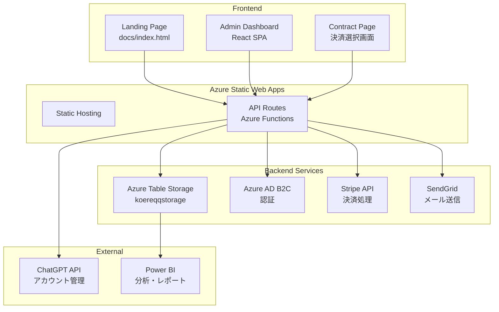
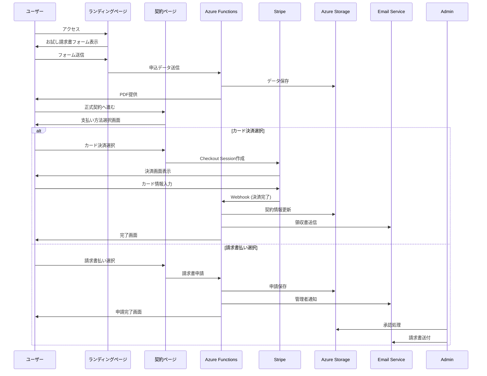

# 管理画面とペイメントシステム アーキテクチャ設計書

**作成日時**: 2025年6月4日  
**プロジェクト**: ChatGPT Plus LP

## 1. システム全体アーキテクチャ



## 2. 管理画面（Admin Dashboard）詳細設計

### 2.1 画面構成

#### ダッシュボード（ホーム）
```typescript
interface DashboardStats {
  totalApplications: number;        // 総申込数
  pendingApplications: number;      // 処理待ち
  activeAccounts: number;          // アクティブアカウント数
  monthlyRevenue: number;          // 月間売上
  conversionRate: number;          // コンバージョン率
}
```

**表示要素**:
- 統計カード（上記指標）
- 最新申込リスト（10件）
- 売上グラフ（週次/月次）
- タスクリマインダー

#### 顧客管理画面
```typescript
interface Customer {
  id: string;
  email: string;
  organization: string;
  name: string;
  chatGptEmail?: string;          // 紐付けされたChatGPTアカウント
  status: 'trial' | 'active' | 'suspended' | 'cancelled';
  plan: 'basic' | 'plus' | 'enterprise';
  paymentMethod: 'card' | 'invoice';
  createdAt: Date;
  lastActivityAt: Date;
}
```

**機能**:
- 検索・フィルタリング
- 一括操作（ステータス変更等）
- 詳細表示・編集
- ChatGPTアカウント紐付け
- 利用履歴表示

#### アカウント紐付け画面
```typescript
interface AccountLinking {
  customerId: string;
  customerEmail: string;
  chatGptEmail: string;
  linkedAt: Date;
  linkedBy: string;              // 管理者ID
}
```

**ワークフロー**:
1. 顧客選択
2. ChatGPTメールアドレス入力
3. 確認・紐付け実行
4. 自動通知送信

### 2.2 技術実装詳細

#### フロントエンド構成
```
admin-dashboard/
├── src/
│   ├── components/
│   │   ├── Dashboard/
│   │   ├── Customers/
│   │   ├── Accounts/
│   │   └── Common/
│   ├── hooks/
│   │   ├── useAuth.ts
│   │   ├── useCustomers.ts
│   │   └── useApi.ts
│   ├── services/
│   │   ├── api.ts
│   │   ├── auth.ts
│   │   └── storage.ts
│   └── App.tsx
├── package.json
└── tsconfig.json
```

#### API エンドポイント設計
```typescript
// 顧客管理API
GET    /api/customers              // 一覧取得
GET    /api/customers/:id          // 詳細取得
PUT    /api/customers/:id          // 更新
POST   /api/customers/:id/link     // アカウント紐付け

// ダッシュボードAPI
GET    /api/dashboard/stats        // 統計情報
GET    /api/dashboard/recent       // 最新データ

// アカウント管理API
POST   /api/accounts/provision     // ChatGPTアカウント作成
GET    /api/accounts/:id/usage     // 利用状況取得
```

## 3. ペイメントフロー詳細設計

### 3.1 全体フロー



### 3.2 カード決済（Stripe）実装

#### Checkout Session 作成
```typescript
// Azure Function: create-checkout-session.ts
import Stripe from 'stripe';

export async function createCheckoutSession(req: HttpRequest): Promise<HttpResponse> {
  const stripe = new Stripe(process.env.STRIPE_SECRET_KEY);
  const { customerId, plan } = req.body;
  
  const session = await stripe.checkout.sessions.create({
    payment_method_types: ['card'],
    customer_email: customerId,
    line_items: [{
      price: getPriceId(plan),  // 事前に作成したStripe Price ID
      quantity: 1,
    }],
    mode: 'subscription',
    success_url: `${process.env.SITE_URL}/success?session_id={CHECKOUT_SESSION_ID}`,
    cancel_url: `${process.env.SITE_URL}/cancel`,
    metadata: {
      customerId,
      plan
    }
  });
  
  return { 
    statusCode: 200, 
    body: JSON.stringify({ sessionId: session.id }) 
  };
}
```

#### Webhook処理
```typescript
// Azure Function: stripe-webhook.ts
export async function handleStripeWebhook(req: HttpRequest): Promise<HttpResponse> {
  const stripe = new Stripe(process.env.STRIPE_SECRET_KEY);
  const sig = req.headers['stripe-signature'];
  
  let event: Stripe.Event;
  
  try {
    event = stripe.webhooks.constructEvent(
      req.rawBody,
      sig,
      process.env.STRIPE_WEBHOOK_SECRET
    );
  } catch (err) {
    return { statusCode: 400, body: 'Webhook Error' };
  }
  
  switch (event.type) {
    case 'checkout.session.completed':
      await handleCheckoutComplete(event.data.object);
      break;
    case 'invoice.payment_succeeded':
      await handleInvoicePayment(event.data.object);
      break;
    // その他のイベント処理
  }
  
  return { statusCode: 200, body: 'OK' };
}

async function handleCheckoutComplete(session: Stripe.Checkout.Session) {
  // 1. 顧客情報をDBに保存
  await updateCustomerStatus(session.metadata.customerId, 'active');
  
  // 2. ChatGPTアカウント作成をキューに追加
  await queueAccountProvisioning(session.metadata.customerId);
  
  // 3. 領収書メール送信
  await sendReceiptEmail(session.customer_email, session.id);
}
```

### 3.3 請求書払い実装

#### 申請フォーム
```typescript
interface InvoiceRequest {
  customerId: string;
  companyName: string;
  billingAddress: string;
  taxId?: string;              // 法人番号
  contactPerson: string;
  contactEmail: string;
  plan: string;
  notes?: string;
}
```

#### 処理フロー
```typescript
// Azure Function: request-invoice.ts
export async function requestInvoice(req: HttpRequest): Promise<HttpResponse> {
  const request: InvoiceRequest = req.body;
  
  // 1. 申請をDBに保存
  const requestId = await saveInvoiceRequest(request);
  
  // 2. 請求書番号を採番
  const invoiceNumber = await generateInvoiceNumber();
  
  // 3. 管理者に通知
  await notifyAdminOfInvoiceRequest({
    requestId,
    invoiceNumber,
    ...request
  });
  
  // 4. 申請者に確認メール
  await sendInvoiceRequestConfirmation(request.contactEmail, invoiceNumber);
  
  return {
    statusCode: 200,
    body: JSON.stringify({ 
      success: true, 
      invoiceNumber,
      message: '請求書発行申請を受け付けました' 
    })
  };
}
```

## 4. アカウント自動管理システム

### 4.1 プロビジョニングフロー

```typescript
// Azure Function: provision-account.ts
interface ProvisioningRequest {
  customerId: string;
  email: string;
  plan: string;
}

export async function provisionChatGPTAccount(req: ProvisioningRequest) {
  try {
    // 1. ChatGPT APIでアカウント作成（仮想的な例）
    const account = await createChatGPTAccount({
      email: req.email,
      plan: mapPlanToChatGPT(req.plan)
    });
    
    // 2. アカウント情報をDBに保存
    await saveAccountMapping({
      customerId: req.customerId,
      chatGptAccountId: account.id,
      chatGptEmail: account.email,
      status: 'active'
    });
    
    // 3. 顧客に通知
    await sendAccountReadyNotification(req.email, account);
    
    return { success: true, accountId: account.id };
  } catch (error) {
    // エラーハンドリング
    await logProvisioningError(req.customerId, error);
    throw error;
  }
}
```

### 4.2 利用状況モニタリング

```typescript
// 定期実行Function（Timer Trigger）
export async function monitorUsage() {
  const activeAccounts = await getActiveAccounts();
  
  for (const account of activeAccounts) {
    // 1. ChatGPT APIから利用状況取得
    const usage = await getChatGPTUsage(account.chatGptAccountId);
    
    // 2. DBに保存
    await saveUsageData({
      accountId: account.id,
      date: new Date(),
      messagesCount: usage.messages,
      tokensUsed: usage.tokens,
      cost: calculateCost(usage)
    });
    
    // 3. 制限チェック
    if (usage.tokens > account.tokenLimit * 0.8) {
      await sendUsageWarning(account.email, usage);
    }
  }
}
```

## 5. データモデル設計

### 5.1 Azure Table Storage エンティティ

```typescript
// 顧客エンティティ
interface CustomerEntity extends TableEntity {
  PartitionKey: 'Customer';
  RowKey: string;              // customerId
  email: string;
  organization: string;
  name: string;
  plan: string;
  status: string;
  paymentMethod: string;
  stripeCustomerId?: string;
  chatGptAccountId?: string;
  createdAt: string;
  updatedAt: string;
}

// アカウントマッピングエンティティ
interface AccountMappingEntity extends TableEntity {
  PartitionKey: 'AccountMapping';
  RowKey: string;              // customerId
  chatGptEmail: string;
  chatGptAccountId: string;
  linkedAt: string;
  linkedBy: string;
}

// 利用状況エンティティ
interface UsageEntity extends TableEntity {
  PartitionKey: string;        // 'Usage-YYYY-MM'
  RowKey: string;              // accountId-timestamp
  messagesCount: number;
  tokensUsed: number;
  cost: number;
  date: string;
}
```

## 6. セキュリティ考慮事項

### 6.1 認証・認可
- Azure AD B2Cによる管理者認証
- Role-Based Access Control (RBAC)
- API キー管理（Azure Key Vault使用）

### 6.2 データ保護
- 通信の暗号化（HTTPS必須）
- 個人情報の暗号化保存
- アクセスログの記録

### 6.3 コンプライアンス
- GDPR/個人情報保護法準拠
- PCI DSS準拠（Stripe経由でカード情報非保持）
- 監査ログの保持

## 7. 実装優先順位

### Phase 1（1-2週間）
1. 管理画面の基本実装
   - 認証システム
   - ダッシュボード
   - 顧客一覧

### Phase 2（2-3週間）
2. Stripe統合
   - Checkout実装
   - Webhook処理
   - 領収書自動化

3. 請求書システム
   - 申請フォーム
   - 管理機能

### Phase 3（2週間）
4. アカウント管理
   - 紐付け機能
   - 自動プロビジョニング
   - 利用状況追跡

### Phase 4（1週間）
5. 運用機能
   - 監視・アラート
   - レポート機能
   - 最適化

## 8. 開発環境セットアップ

```bash
# 1. リポジトリクローン
git clone https://github.com/NikoToRA/chatgpt-plus-lp.git
cd chatgpt-plus-lp

# 2. 管理画面プロジェクト作成
npx create-react-app admin-dashboard --template typescript
cd admin-dashboard

# 3. 必要なパッケージインストール
npm install @mui/material @emotion/react @emotion/styled
npm install axios react-router-dom
npm install @azure/msal-browser @azure/msal-react
npm install recharts

# 4. 環境変数設定（.env.local）
REACT_APP_API_URL=http://localhost:7071/api
REACT_APP_AZURE_CLIENT_ID=your-client-id
REACT_APP_STRIPE_PUBLIC_KEY=pk_test_xxx

# 5. Azure Functions開発
cd ../api
npm install @azure/data-tables stripe @sendgrid/mail
npm install --save-dev @types/node typescript

# 6. ローカル実行
npm start  # Functions
cd ../admin-dashboard && npm start  # React
```

---

**次のステップ**: この設計書に基づいて具体的な実装を開始します。まずはセキュリティ改善から着手することを推奨します。