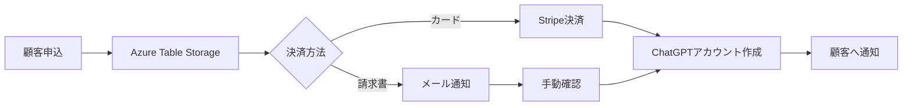

# ChatGPT Plus LP - 更新版Issue整理と実装ロードマップ

**作成日時**: 2025年6月4日  
**更新理由**: Azure Table Storage実装確認と新要件の追加

## 📊 現在の実装状況

### ✅ 実装済み機能

#### 1. Azure Table Storage連携（Issue #1-2相当）
- **API エンドポイント**: `/api/submit-form`
- **データ保存先**: Azure Storage Account `koereqqstorage`
- **テーブル名**: `FormSubmissions`
- **確認方法**: Microsoft Azure Storage Explorerで確認済み
- **課題**: 接続文字列のハードコーディング（セキュリティ改善必要）

#### 2. Power BI連携（Issue #3/9）
- **状態**: PR #39でマージ済み
- **ドキュメント**: 完備
- **DAXクエリ**: 50以上のメジャー提供済み

#### 3. 基本的なランディングページ
- **URL**: `/docs/index.html`
- **機能**: 請求書発行フォーム、見積もり計算機

### 🚧 部分的に実装済み

#### Azure Static Web Apps
- **設定ファイル**: `staticwebapp.config.json`存在
- **課題**: 実際のデプロイは未完了

## 🎯 新要件に基づく実装計画

### Phase 1: 基盤整備（1週間）

#### 1.1 セキュリティ改善
```javascript
// 現在（危険）
const connectionString = "DefaultEndpointsProtocol=https;AccountName=koereqqstorage;AccountKey=..."

// 改善後
const connectionString = process.env.AZURE_STORAGE_CONNECTION_STRING;
```

**タスク**:
- [ ] Azure Static Web Appsの環境変数設定
- [ ] 接続文字列の削除とコード修正
- [ ] Azureストレージキーの更新

#### 1.2 Azure Static Web Appsへの本番デプロイ
- [ ] GitHub Actions ワークフロー設定
- [ ] 環境変数の設定
- [ ] カスタムドメイン設定

### Phase 2: 管理画面開発（2-3週間）

#### 2.1 ユーザーフレンドリーな管理画面

**主要機能**:
1. **ダッシュボード**
   - 申込件数の表示
   - 最新の申込一覧
   - ステータス管理

2. **顧客管理**
   - 顧客情報の閲覧・編集
   - メールとChatGPTアカウントの紐付け
   - アカウントステータス管理

3. **データエクスポート**
   - CSVダウンロード
   - Power BIへの直接連携

**技術スタック案**:
- Frontend: React + TypeScript
- UI Framework: Material-UI or Ant Design
- 認証: Azure AD B2C
- API: Azure Functions

### Phase 3: 契約・決済フロー（3-4週間）

#### 3.1 契約ページの実装

```
[お試し請求書] → [正式契約ページ]
                    ├── カード決済
                    │   ├── Stripe Checkout
                    │   ├── LINK対応
                    │   └── 自動領収書発行
                    └── 請求書払い
                        ├── フォーム入力
                        └── メール問い合わせ
```

#### 3.2 Stripe連携
**実装内容**:
- Stripe Checkout Session API
- Webhook処理（決済確認）
- 領収書自動発行（Stripe Invoice）
- サブスクリプション管理

#### 3.3 請求書払いフロー
**実装内容**:
- 請求書発行申請フォーム
- 管理者への通知
- 請求書番号の自動採番
- PDFテンプレート生成

### Phase 4: 自動化とアカウント管理（2-3週間）

#### 4.1 自動化フロー



#### 4.2 アカウント管理システム
**機能**:
- ChatGPTアカウントの一括管理
- 利用状況モニタリング
- 自動更新・解約処理
- 使用量レポート

## 📋 推奨される新Issue構成

### 基盤・インフラ系
1. **Issue: Azure環境のセキュリティ強化**
   - 環境変数への移行
   - キーローテーション
   - 監査ログ設定

2. **Issue: Azure Static Web Apps本番デプロイ**
   - CI/CD設定
   - ステージング環境構築
   - 本番リリース

### 機能開発系
3. **Issue: 管理画面MVP開発**
   - 基本的なCRUD機能
   - 認証システム
   - ダッシュボード

4. **Issue: Stripe決済統合**
   - Checkout実装
   - Webhook処理
   - 領収書自動化

5. **Issue: 請求書払いシステム**
   - 申請フォーム
   - PDF生成
   - 管理機能

6. **Issue: アカウント自動管理システム**
   - ChatGPT連携API
   - 自動プロビジョニング
   - 利用状況追跡

### 運用・改善系
7. **Issue: メール通知システム**
   - SendGrid/Azure Communication Services
   - テンプレート管理
   - 配信ログ

8. **Issue: 監視・アラートシステム**
   - Application Insights設定
   - エラー通知
   - パフォーマンス監視

9. **Issue: ドキュメント・運用手順整備**
   - 運用マニュアル
   - トラブルシューティング
   - 顧客向けガイド

## 🚀 実装順序と依存関係

```
1. セキュリティ強化（即時対応）
   ↓
2. Azure Static Web Apps デプロイ
   ↓
3. 管理画面MVP ←→ 4. メール通知
   ↓
5. Stripe決済 + 6. 請求書システム
   ↓
7. アカウント自動管理
   ↓
8. 監視システム → 9. ドキュメント整備
```

## 💡 技術的な推奨事項

### アーキテクチャ
- **フロントエンド**: SPA (React) + Azure Static Web Apps
- **バックエンド**: Azure Functions (Node.js/TypeScript)
- **データベース**: Azure Table Storage (現行) → 将来的にCosmos DB検討
- **認証**: Azure AD B2C
- **決済**: Stripe
- **メール**: SendGrid or Azure Communication Services
- **監視**: Application Insights

### セキュリティ
- すべての環境変数をKey Vaultで管理
- APIキーのローテーション自動化
- RBACによるアクセス制御
- 監査ログの有効化

### スケーラビリティ
- Azure Functions のConsumption Plan使用
- CDNによる静的アセット配信
- データベースのパーティショニング戦略

## 📅 タイムライン案

**2025年6月**
- Week 1: セキュリティ改善とデプロイ
- Week 2-4: 管理画面MVP開発

**2025年7月**
- Week 1-2: 決済システム実装
- Week 3-4: アカウント管理自動化

**2025年8月**
- Week 1-2: 運用改善と監視
- Week 3-4: ドキュメント整備と最適化

## 🎯 成功の定義

1. **技術的成功指標**
   - 99.9%のアップタイム
   - 3秒以内のページロード
   - ゼロダウンタイムデプロイ

2. **ビジネス成功指標**
   - 申込から開通まで24時間以内
   - 90%以上の自動化率
   - 顧客満足度95%以上

## 次の具体的アクション

1. **今日中に実施**
   - [ ] Azure環境変数の設定
   - [ ] セキュリティ修正のPR作成

2. **今週中に実施**
   - [ ] 管理画面の技術選定
   - [ ] Stripeアカウント作成
   - [ ] デザインモックアップ作成

3. **来週までに実施**
   - [ ] 管理画面のプロトタイプ
   - [ ] 決済フローのテスト環境構築

---

**作成者**: Claude  
**レビュー待ち**: @NikoToRA